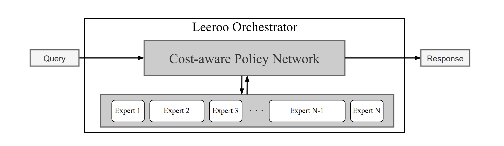

<h1>Leeroo Orchestrator </h1>

[](#python)
[](https://opensource.org/licenses/MIT) 

Overview
-------------
### Orchestration of Experts

Leeroo Orchestrator is a pioneering architecture that orchestrates expert LLMs to deliver state-of-the-art AI solutions. It's designed to dynamically select and leverage the best expert models for any given task, continuously evolving to incorporate new expertise and achieve superior performance with cost efficiency.
<p align="center">
  
</p>

### Quick Start

- **[Get Started](https://docs.google.com/forms/d/e/1FAIpQLSfv6qgFqzVAZrSiTapEewoFDOL5hPr5Nw8Z3WuYhADSDxb2EA/viewform)**: Request access to start using Leeroo Orchestrator V1.
- **[Contribute](CONTRIBUTING.md)**: Interested in contributing? Check our contributor guide.
- **[Documentation]()**: For more detailed information about using Leeroo Orchestrator.

### Dive Deeper

If you're interested in the mechanics behind Leeroo Orchestrator and our vision for AI's future:
- **[Blog Post](https://www.leeroo.com/post/leeroo-orchestrator-v1-towards-an-ai-operating-system)**: Read about our journey towards creating an AI Operating System.
- **[Research Paper](https://arxiv.org/abs/2401.13979)**: Explore the detailed study behind Leeroo Orchestrator's development.

Leeroo Orchestrator evolves AI by first leveraging the best LLMs available, then identifying gaps in expertise to develop ultra-efficient experts, and finally learning to integrate these new experts. This cycle ensures continuous improvement in both the depth and breadth of AI capabilities over time.


Content
-------------

- **[News Release](#news)**  
- **[Installation](#installation)**  
- **[Community](#community)**  
- **[Citation](#citation)**  


<a name="news"/>  

News Release
-------------

### Leeroo Orchestrator V1: Next-level LLMs by Orchestration of Experts

Leeroo Orchestrator features a lightweight LLM that knows when and how to leverage underlying LLM experts to perform a task with the best outcome. We create multiple new state-of-the-art results with Leeroo V1:

- **State-of-the-art open-source**: When leveraging open-source models, the Leeroo Orchestrator achieves **76% accuracy on the MMLU benchmark— with the same budget as Mixtral (70.6%)**.

- **Achieving and beyond GPT4**: Combining open-source models with GPT4, the Orchestrator nearly matches GPT4's performance at half the cost. Moreover, it even **surpasses GPT4’s performance with 25% less cost**.

- **Accessible**: Leeroo can be served on accessible consumer hardware and can be deployed on any cloud provider or on-prem.

Through a dynamic training process that leverages a self-play loop, the Orchestrator learns from the evaluations of responses of various expert models to generated questions, continually refining its ability to select the most suited expert for each task. This continual learning, enhanced by integrating new models, ensures the Orchestrator's responses become increasingly accurate and efficient, setting a foundation for future releases.

Central to our vision is reshaping LLMs by focusing on domain-specific expertise. Current LLMs often overlap in knowledge, lacking depth. The Orchestrator not only identifies the most effective expert for immediate tasks but also highlights areas lacking in-depth expertise, guiding the development of new, ultra-efficient domain-specific models.

As we gradually roll out **access to Leeroo V1 API** on a first-come, first-served basis, we're eager for you to experience the capabilities of Leeroo firsthand and encourage interested parties to [request access](https://docs.google.com/forms/d/e/1FAIpQLSfv6qgFqzVAZrSiTapEewoFDOL5hPr5Nw8Z3WuYhADSDxb2EA/viewform). We're also open to discussions about the potential for tailored Virtual Private Cloud (VPC) or on-premise installations. Our production system, currently based on **VLLM** on **EC2** and **SageMaker**, is expanding to accommodate more cloud providers.

As we start training Leeroo V2, your insights are invaluable to us. Whether you're a researcher in AI, an AI practitioner, or simply an enthusiastic user, we're eager to integrate your ideas into the next iteration of Leeroo. We invite you to share your thoughts and suggestions with us and join us in shaping the future of AI together. Additionally, the deployment of Leeroo V1, as well as the training of Leeroo V2, require significant GPU resources. If you are able to support us in this area, please reach out.

For a deeper dive into the Leeroo Orchestrator V1, refer to our [publication](https://arxiv.org/abs/2401.13979). Results are available at [here](https://drive.google.com/file/d/13hKt8KYH8j7HCPixrAyl9rGhOFCOhsOo/view?usp=sharing).

<a name="installation"/>  

Installation
-------------

Setup the repo and install required pakages.
```
pip intall -e .
```

### Running on Ec2 using Vllm
For users who favor EC2 on-premise private deployment, we have open-sourced an AWS AMI that comes preinstalled with PyTorch2 and VLLM, please refer [docs]() for detailed insight. We provide demo configurations that facilitate deploying one model per instance. If you wish to deploy multiple models on the same instance, simply alter the tmux session name in the corresponding configuration. It is recommended to have the following environment variables prepared for the seamless launch of an instance declared in *.env* file :     
```py
AWS_ACCESS_KEY_ID       = "*****"
AWS_SECRET_ACCESS_KEY   = "*****"
SECURITY_GROUP_ID       = "*****"    
```
The SecurityGroupId is utilized in the instance creation process. It is imperative to ensure that the inference port is open for this specific security group.  
Refer this file *app/configs/demo_orch_ec2_mix.json* for preparing required configs for ec2 deploynent.

### Running on Sagemaker
Amazon SageMaker is a service designed to facilitate one-click private on-premise deployment of models, offering managed infrastructure, tools, and workflows. Users are required to set up their own execution role, thereby gaining access to SageMaker deployments. [link](https://docs.aws.amazon.com/sagemaker/latest/dg/sagemaker-roles.html). Following vaiables should be declared in *.env* file :   
```py
AWS_SAGEMAKER_ROLE_NAME = "*****"   
AWS_ACCESS_KEY_ID       = "*****"    
AWS_SECRET_ACCESS_KEY   = "*****"   
HUGGING_FACE_HUB_TOKEN  = "*****"   
```
Refer this file *app/configs/demo_orch_sagemaker_mix.json* for preparing required configs for sagemaker deployments.


### Closed Source Expert
We currently offer support for OpenAI text generation models, and API's that are callable using openai sdk. In the near future, we plan to extend our support to include all major closed-source language model APIs (Claude2, Gemini, etc). To establish a connection with OpenAI, the following variables must be specified in the .env file:
```py
OPENAI_ORGANIZATION     = "*****"
OPENAI_API_KEY          = "*****"
```


#### Run Leeroo Orchestrator
```python
import json
from app.orchestrator import Orchestrator

config = json.load(open("app/configs/demo_orch_sagemaker_mix.json", "r"))

# init
leeroo_orchestrator = Orchestrator(config)

# boot the machines
leeroo_orchestrator.load_orchestrator_server()
leeroo_orchestrator.load_experts_server()

# start the inference endpoints
leeroo_orchestrator.start_inference_endpoints(max_wait_time=120)

# Wait until all endpoints are up
status = False
while not status:
    status = leeroo_orchestrator.check_servers_state()
    if status: print("Servers are running..."); break
    time.sleep(30)

# Get text Generations, running the complete pipeline
response = leeroo_orchestrator.get_response("If you could have a conversation with a fictional character, who would it be and why?")
print(response)

# turn off the machines
leeroo_orchestrator.orchestrator.stop_server()
for expert_id, expert in leeroo_orchestrator.experts.items():
    res = expert.stop_server()
    print(res)
``` 

<a name="community"/>   

Join our community!
-------------
🚀 Join the social media vibe with us?

- [Twitter](https://twitter.com/leeroo_ai)
- [LinkedIn](https://www.linkedin.com/company/leeroo)
- [Website](https://www.leeroo.com)


<a name="citation"/>  

Citation
-------------  

If you use this code for your research, please cite the following work:  


```
@misc{mohammadshahi2024leeroo,
    title={Leeroo Orchestrator: Elevating LLMs Performance Through Model Integration},
    author={Alireza Mohammadshahi and Ali Shaikh and Majid Yazdani},
    year={2024},
    eprint={2401.13979},
    archivePrefix={arXiv},
    primaryClass={cs.CL}
}
```

Have a question not listed here? Open [a GitHub Issue](https://github.com/Leeroo-AI/leeroo_orchestrator_private/issues) or 
send us an [email](alireza@leeroo.com).
